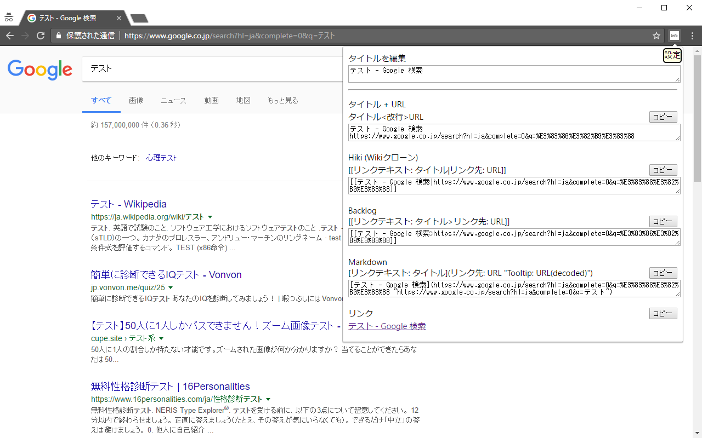
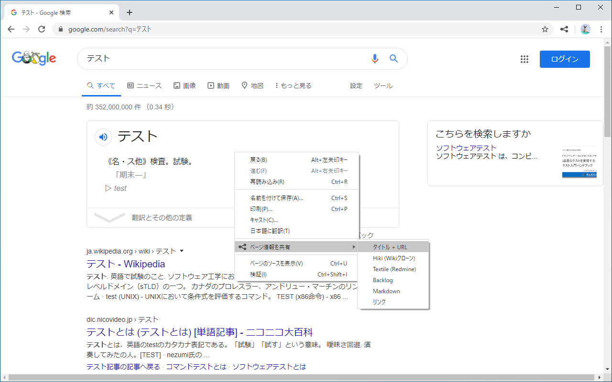

# chrome-extension_share-page-information
ページのタイトルとURLを共有しやすいフォーマットに変更

[Chromeストア](https://chrome.google.com/webstore/detail/nnnflohcklplblcndpidebcbkdfbjmdm)

## コピー方法
1. ポップアップから
    
1. 右クリックメニューから
    

## 対応書式
* タイトル<改行>URL
* Hiki (Wikiクローン) 書式：`[[タイトル|URL]]`
* Textile (Redmine) 書式：`"リンクテキスト: タイトル":リンク先: URL`
* Backlog 書式：`[[タイトル>URL]]`
* Markdown書式：`[リンクテキスト](URL "タイトル(tooltip)")`
* リンク（OfficeなどHTMLのコピーに対応している製品用）

## アイコン
[アイコン素材ダウンロードサイト「icooon-mono」](https://icooon-mono.com/)
の
[シェアのアイコン素材](https://icooon-mono.com/00054-%E3%82%B7%E3%82%A7%E3%82%A2%E3%81%AE%E3%82%A2%E3%82%A4%E3%82%B3%E3%83%B3%E7%B4%A0%E6%9D%90/)
を使わせていただきました。
