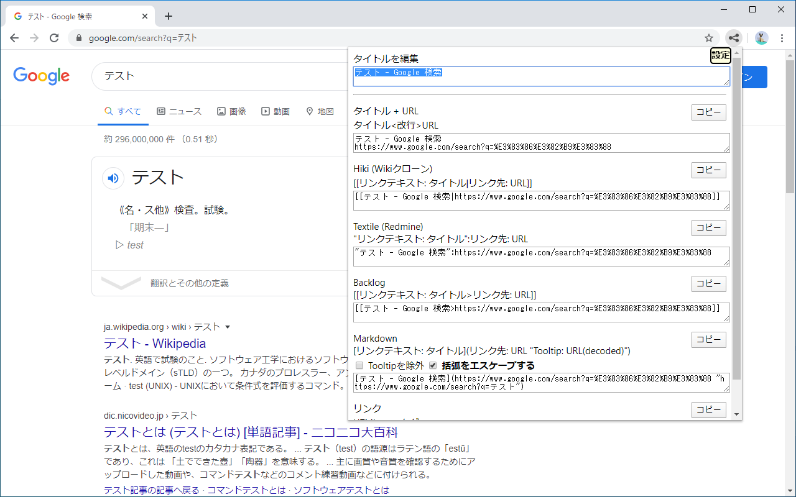

# chrome-extension_share-page-information
ページのタイトルとURLを共有しやすいフォーマットに変更

[Chromeストア](https://chrome.google.com/webstore/detail/nnnflohcklplblcndpidebcbkdfbjmdm)

## 対応書式
* タイトル<改行>URL
* Hiki (Wikiクローン) 書式：[[タイトル|URL]]
* Backlog 書式：[[タイトル>URL]]
* Markdown書式：\[リンクテキスト](URL "タイトル(tooltip)")
* リンク（OfficeなどHTMLのコピーに対応している製品用）
